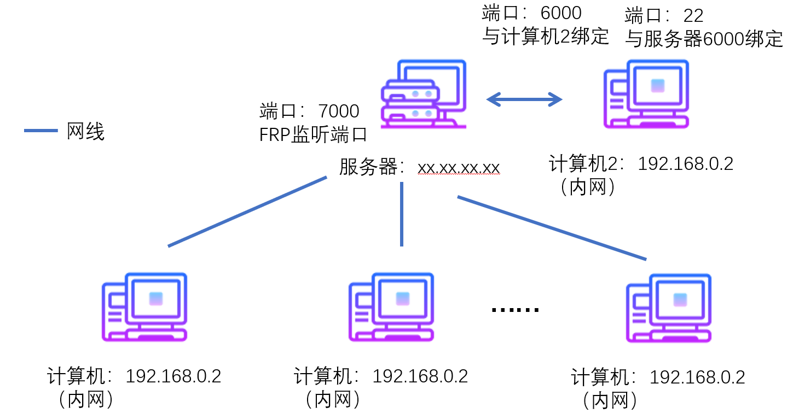
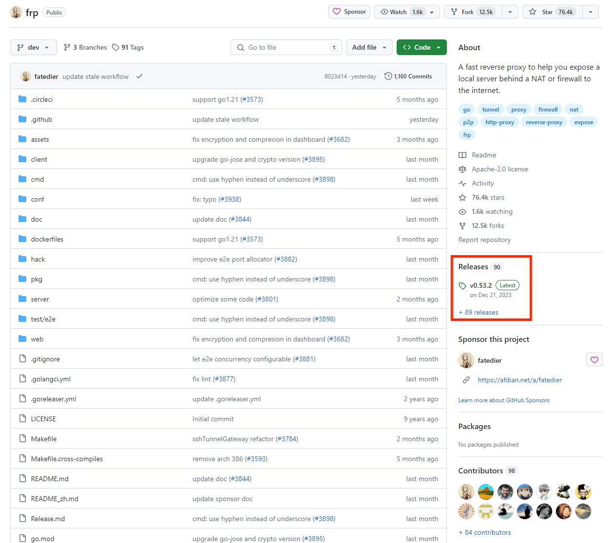
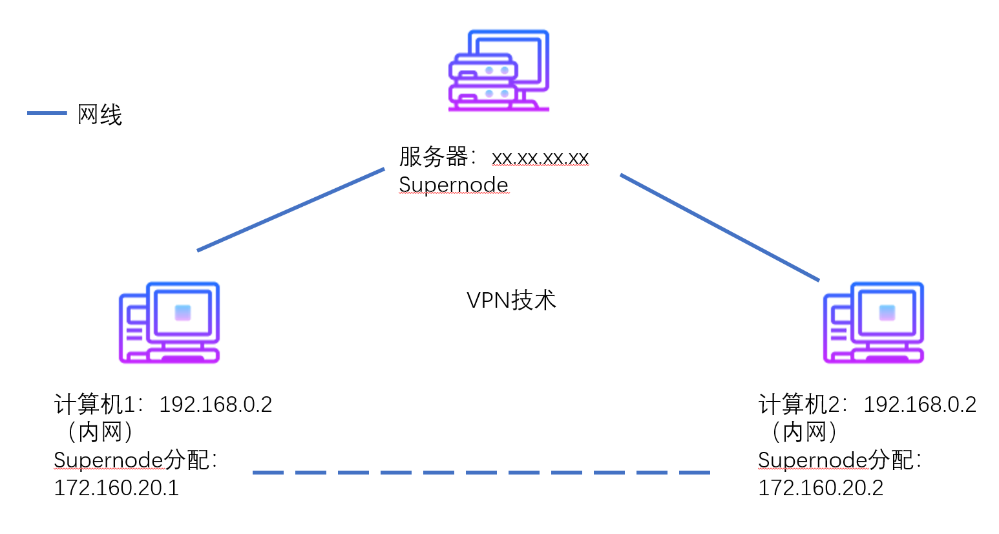
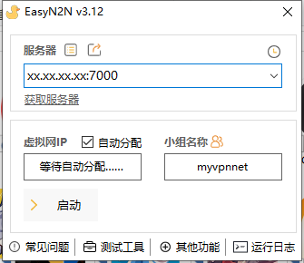

# NAT转发（即内网穿透）&VPN搭建教程

## 1. 准备阶段
需要准备一个云服务器，该服务器需要有公网ip，该服务器只进行流量转发功能，故CPU和内存配置可以稍微差一些，但是网络应该好些，系统建议选择ubuntu，本教程使用ubuntu，centos有些指令不一样（如apt和yum），但是可以询问Chatgpt进行指令转换，效果一致。  
你需要掌握使用xshell和xftp等一类ssh软件连接你的远程服务器的方法，具体来说就是使用你的服务器的公网ip，用户名是root，密码是你服务器提供商管理页面的密码进行登录。

内网穿透教程使用软件：**FRP**  
github主页：<https://github.com/fatedier/frp>  
FRP是使用Go语言编写的，能够支持linux/windows的NAT转发软件，注意NAT转发是一个比较大的概念，内网穿透是NAT转发的应用之一。

VPN搭建使用软件：**N2N**
github主页：<https://github.com/ntop/n2n>  
N2N是使用P2P技术进行VPN搭建的软件，支持linux。  
在windows端我们使用Bug侠的带GUI的N2N，即EasyN2N。
Bug侠主页：<https://bugxia.com/>  


## 2. 内网穿透教程
### 2.1 原理解析

计算机2的22端口通过与服务器的6000端口绑定（图右上），使得**任何计算机**都能够通过22端口（即ssh）访问计算机2。
内网穿透的特性是任何你允许的计算机都可以访问完成了穿透的那个计算机，而这些计算机之间并无关联。
 
### 2.2 搭建步骤
#### 2.2.1 软件下载
前往[frp官网](https://github.com/fatedier/frp)，软件在release中下载，进不去github的可以用steam++加速
release位置如图

**linux**
下载linux_amd64.tar.gz版本

**windows**
下载windows_amd64.zip版本
关闭windows实时防护，会误杀

#### 2.2.2 配置toml
为了防止麻烦，我们都在windows端进行配置。  
toml可以使用记事本，写字板，sublimetext进行编辑。  
frpc代表frp client，即客户端，需要穿透内网的那台计算机2，frps代表frp server，即具有公网ip的服务器。  
如果按照图中的方法进行配置，则先到linux版本的文件中编辑frps.toml如下
```json
bindPort = 7000
```
然后到windows版本的文件夹中编辑frpc.toml，修改serverAddr字段
```json
//你的公网ip
serverAddr = "xx.xx.xx.xx"
serverPort = 7000

[[proxies]]
//name是区分用，你这个服务的名字
name = "test-tcp"
//TCP还是UDP
type = "tcp"
localIP = "127.0.0.1"
//本地开放端口
localPort = 22
//与服务器哪个端口绑定
remotePort = 6000
```

#### 2.2.3 开启服务
在开启服务前先开放端口放行，需要从控制台和系统两方面放行。
控制台登录你服务器的控制台放行6000和7000端口，一般在安全规则里，不会搞的可以去搜索xx云如何开启端口。

以下是系统层面开启防火墙端口放行（ubuntu系统）
查看防火墙状态
```shell
ufw status
```

开启防火墙
```shell
ufw enable
```

关闭防火墙（举例）
```shell
ufw disable
```

放行6000和7000端口
```shell
ufw allow 6000
ufw allow 7000
```

关闭6000端口（举例，不要关）
```shell
ufw deny 6000
```

刷新规则
```shell
ufw reload
```

**开启服务linux**
将你的linux文件夹使用xftp拖到服务器的用户目录下，假设你是root，则拖到~/下，即/root下，将该文件夹命名为frp。
```shell
cd ~/frp
./frps -c frps.toml
```

**开启服务windows**
在你的windows版本文件夹下开启cmd
```shell
frpc.exe -c frpc.toml
```

#### 2.2.4 验证连接
开启windows的ssh服务。
设置里，系统->可选功能->添加功能->openssh服务器
服务->有关openssh的两项服务启用
然后使用cmd中的ssh指令连接你的本机，6000是因为你的配置里绑定的是6000
```shell
ssh -p 6000 用户名@公网ip
```
如果连接成功，则证明内网穿透成功。

# 3. VPN搭建教程
## 3.1 原理解析

计算机1和计算机2通过supernode的协调，得到分别的ip地址，二者能够直接沟通，这就是VPN技术，与内网穿透不同，没通过supernode协调的计算机无法访问内网计算机，而内网计算机之间也可以相互访问。

### 3.2 搭建步骤
#### 3.2.1 软件下载
前往[N2N官网](https://github.com/ntop/n2n)，软件在release中下载，进不去github的可以用steam++加速
Ubuntu下载amd64.deb版，目前官网是n2n_3.0.0-1038_amd64.deb，我将使用这个名字，如果版本更新了，请将下面指令进行替换

#### 3.2.2 开启服务
将deb包使用xftp拖到根目录下，依旧假设你是root，拖到了~/下
安装libzstd和deb包
```shell
cd ~
apt-get install libzstd-dev -y
dpkg -i n2n_3.0.0-1038_amd64.deb
```

接下来开启服务，端口放行请参照2.2.3，以7000端口为例
```shell
supernode -p 7000 -f
```
如果想使其后台运行，则去掉-f

#### 3.2.3 windows电脑连接
下载[easyN2N](https://bugxia.com/357.html)，注意关闭windows实时防护，会报毒。


上面填你的公网ip和你刚执行supernode的端口，小组名称需要组网的电脑统一。
启动即可。

#### 3.2.4 验证组网成功
去windows的网络里，你能看到局域网内的电脑，如果出现目标电脑则代表连接成功。

或使用cmd指令
```shell
arp -a
```
查看你被分配的ip下的所有动态ip地址

# 4. 一些技术（进阶）
## 4.1 宝塔
在申请下来服务器后建议装一个宝塔管理面板

## 4.2 开机启动
写service可以进行开机启动操作，frp是没有service的，supernode是有service的

**对于没有service的frp来说**
```shell
vim /etc/systemd/system/frp.service
```

```shell
[Unit]
Description=FRP Server
After=network.target

[Service]
ExecStart=~/frps -c ~/frps.toml
Restart=always
User=nobody
Group=nogroup

[Install]
WantedBy=multi-user.target
```

设置开机启动
```shell
systemctl enable frp
```

启动
```shell
systemctl start frp
```

**对于有service的supernode来说**
需要调整它的config文件，将端口设置为你要开放的端口
```shell
vim /etc/n2n/supernode.conf
```

设置开机启动
```shell
systemctl enable supernode
```

启动
```shell
systemctl start supernode
```

**另外几个常用指令**
查看服务状态，以frp为例
```shell
systemctl status frp
```
停止服务
```shell
systemctl stop frp
```
查看进程的进程号
```shell
ps -aux | grep frp
```
杀死进程
```shell
kill -9 进程号
```